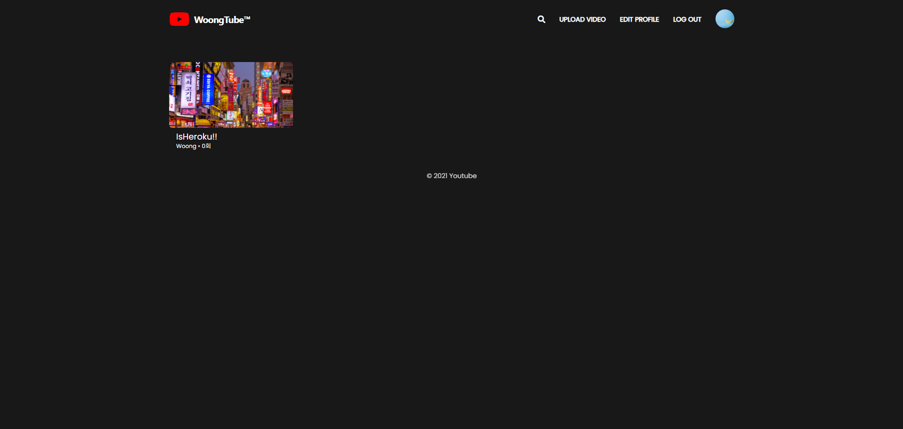
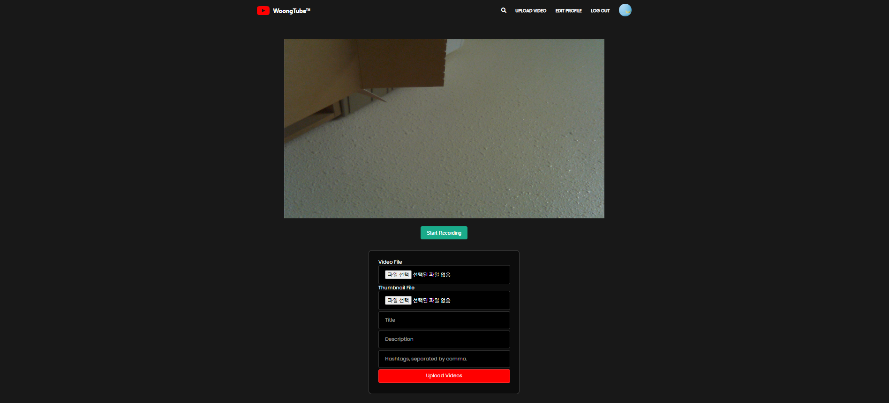
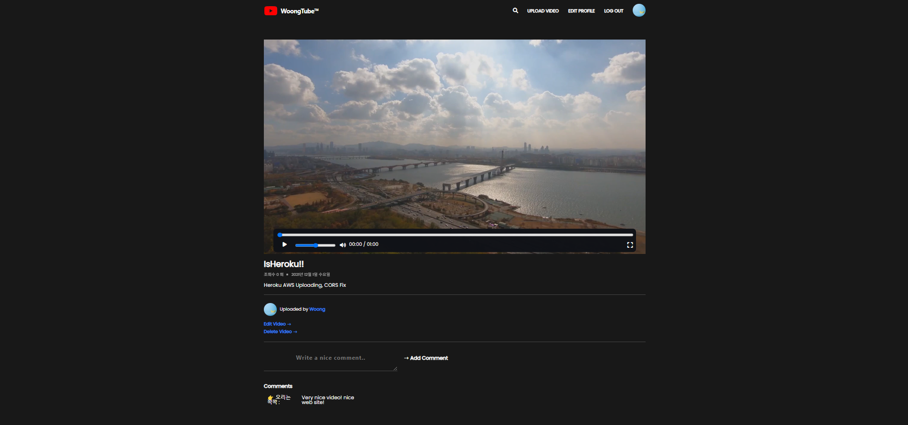
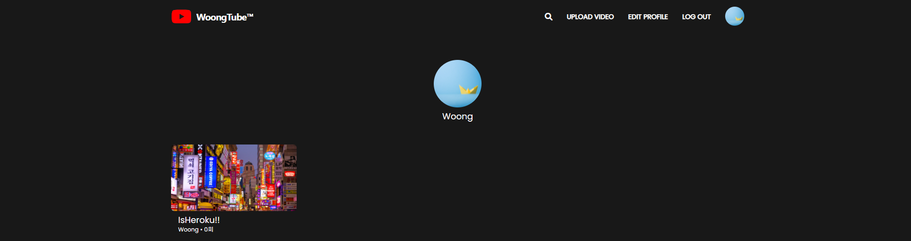

# 📌 Youtube Coding

- WoongTube
- FullStack = Server + Client + Deployment
- Using both classic SSR and CSR.
- Development progress : dev:server ➡️ dev:front ➡️ build ➡️ deployment

<br/>

## 🔥Summary Skill icons

<p>
<strong>• Language</strong>&nbsp&nbsp&nbsp
</a> &nbsp
</a> &nbsp
</a> &nbsp
</p>
<p> 
<strong>• FrameWork</strong>&nbsp&nbsp&nbsp
</a> &nbsp
</p>
<p> 
<strong>• DataBase</strong>&nbsp&nbsp&nbsp
</a> &nbsp
</a> &nbsp
</p>
<p>
<strong>• API & Tech Stack</strong>&nbsp&nbsp&nbsp
</a> &nbsp
</a> &nbsp
</a> &nbsp
</a> &nbsp
</a> &nbsp
</a> &nbsp
</a> &nbsp
</p>
<p>
<strong>• Style</strong>&nbsp&nbsp&nbsp
</a> &nbsp
</p>
<p>
<strong>• Deployment</strong>&nbsp&nbsp&nbsp
</a> &nbsp
</a> &nbsp
</p>
<p>
<strong>• Environment</strong>&nbsp&nbsp&nbsp
</a> &nbsp
</a> &nbsp
</p>
<br />

## ➡️ Table of Contents

- [📌 Youtube Coding](#-youtube-coding)
  - [🔥Summary Skill icons](#summary-skill-icons)
  - [➡️ Table of Contents](#️-table-of-contents)
  - [✅ Gallery](#-gallery)
  - [✅ Installation](#-installation)
  - [✅ Usage](#-usage)
  - [✅ Project function](#-project-function)
  - [✅ 프로젝트 결과](#-프로젝트-결과)
  - [✅ Document](#-document)
  - [✅ Notion](#-notion)
  - [✅ Stack](#-stack)
  - [✅ Contributor](#-contributor)

<br/>

## ✅ Gallery

👉 **[Here](https://woongtube.herokuapp.com/)**

<br/>

## ✅ Installation

```shell
npm install
```

<br/>

## ✅ Usage

```shell
npm run start
```

- file create `.env` package.json root

```
COOKIE_SECRET = <ANYWHERE>
DB_URL = <MONGODB>
GH_CLIENT = <Github OAuth APP CLIENTID>
GH_SECRET= <Github OAuth APP CLIENTID SECRETS>
AWS_ID = <AWS IAM ACCESSKEY>
AWS_SECRET = <AWS IAM SECRETKEY>
```

❗수정시 package.json에서 `devDependencies` 참조하여 추가 npm 설치필요

<br/>

## ✅ Project function

- **로그인 & 회원가입**

  - 회원가입 기능
  - Github 소셜 회원가입 기능
  - 로그인 기능 / 소셜 로그인
  - 로그아웃 기능

<br>

- **동영상 업로드**

  - 동영상 recording으로 직접 저장
  - 비디오와 썸네일을 선택해 업로딩하는 기능

<br>

- **메뉴**
  - 찾기 기능으로 동영상을 편하게 찾기 가능
  - 동영상 업로드 편집 기능으로 수정
  - 프로필을 직접 확인함으로 사용자가 올린 동영상 확인

<br>

- **동영상**
  - 비디오 플레이어를 제작하여 특색있고 심플한 디자인
  - 제목, 조회수, 동영상 업로드 날짜 및 설명 표현
  - 사용자가 올린 동영상의 프로필 확인 기능
  - 동영상 사용자는 직접 편집기능, 삭제 기능
  - 로그인한 사용자들은 comment를 달아 상호작용 가능

<br>

## ✅ 프로젝트 결과

| Example                            |              Example               |
| ---------------------------------- | :--------------------------------: |
|  |  |
|  |  |

<br>

## ✅ Document

- [NPM](https://www.npmjs.com/)
- [Babel](https://babeljs.io/docs/en/)
- [Express](https://expressjs.com/ko/4x/api.html#res.send)
- [Pug](https://pugjs.org/api/getting-started.html)
- [Mongo](https://docs.mongodb.com/manual/tutorial/query-documents/)
- [Mongoose](https://mongoosejs.com/docs/queries.html)
- [Github Auth](https://docs.github.com/en/developers/apps/building-oauth-apps/authorizing-oauth-apps)
- [Webpack](https://webpack.js.org/concepts/)
- [FontAwesome](https://cdnjs.com/libraries/font-awesome)
- [MDN](https://developer.mozilla.org/ko/docs/Web/API/HTMLMediaElement)
- [FFmpeg](https://github.com/ffmpegwasm/ffmpeg.wasm)
- [Heroku](https://devcenter.heroku.com/categories/reference)
- [AWS S3](https://docs.aws.amazon.com/s3/?id=docs_gateway)

<br>

## ✅ Notion

<br>

## ✅ Stack

```markdown
[Controller]
"NodeJS"
"ES6"
"Express"
"Babel"
"Passport"
"Bcrypt"
"SocialLogin"
"ESLint"
"Multer"
"regenerator-runtime"

[Model]
"MongoDB"
"Mongoose"
"RelationShips"

[View]
"AJAX"
"Pug"
"SCSS"
"Webpack"
"FFmpeg"
"Webassembly"

[Deployment]
"Mongo Atlas"
"Heroku git"
"AWS S3"
```

<br>

## ✅ Contributor

<!-- <a href="https://github.com/parkgeonwoong"></a> -->

| <a href="https://github.com/parkgeonwoong"></a> |
| ----------------------------------------------------------------------------------------------------------------------------------------------------------------------------- |
| parkgeonwoong                                                                                                                                                                 |
